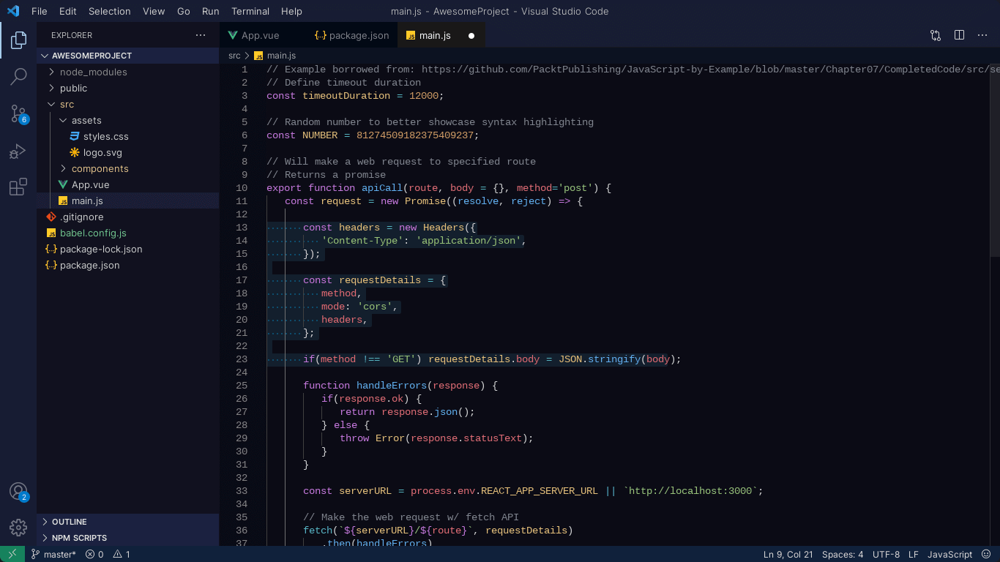
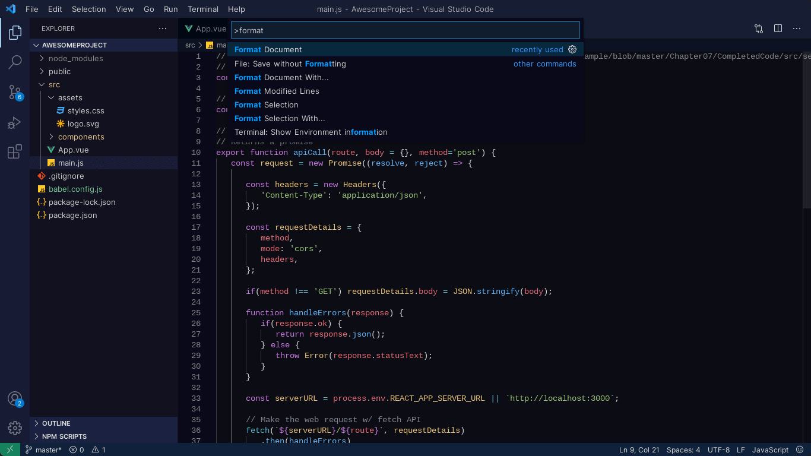
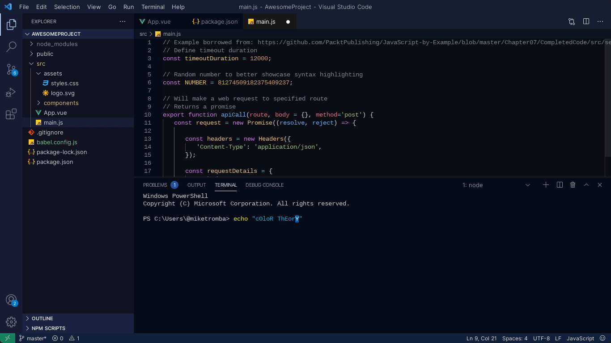

	

 

## Kai 🌊

🌊 Aloha! _**Kai**_: Where Code Meets the Sea. Immerse yourself in the tranquil depths of coding with this refreshing VS Code theme inspired by the beauty of the Hawaiian sea. Let the soothing colors of Kai wash over your editor, creating a harmonious environment that enhances your focus and creativity. Experience the serenity of the ocean as you dive into your codebase, where every line of code is a hidden treasure waiting to be discovered. 🦞

 

### Screenshots

	
	 
<em>Editor</em>
 
	
	 
	<em>Command Palette</em>
	 
	
	 
	<em>Terminal</em>

